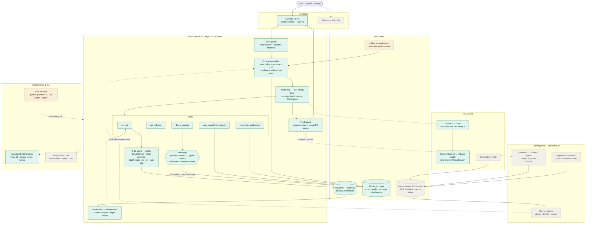

# Architecture

<!-- TODO(doc pass): every section below gets full prose; bullets are scaffolding. -->

## 1. Business context & success criteria

<!-- TODO: problem (execs queue on analysts), success metrics (time-to-insight,
% questions self-served, adoption), explicit non-goals. Write this BEFORE architecture. -->

## 2. System overview

Legend: solid teal = prototype (implemented), dashed amber = stretch, dashed gray = production design (v2).

## 3. Requirement-by-requirement design

Each subsection: production design first, then what the prototype implements.

### 3.1 Hybrid intelligence — the golden bucket

<!-- TODO (the section they said they'll read closely): trio schema w/ lifecycle
metadata (tables_used, verified_by, embedding_version, retrieval_count, success_rate,
last_validated_at); storage = GCS source of truth + vector index (pgvector or BigQuery
VECTOR_SEARCH — 10k trios is SMALL, say so, ops-simplicity drives the choice + growth
path); retrieval = hybrid dense+BM25, metadata filters, top-k + rerank; injection as
few-shot exemplars; update-over-time = expert ingestion + feedback→curation→promotion,
nightly dry-run validation vs schema drift, re-embedding with version tags, held-out
slice as retrieval regression set. Prototype stand-in: golden_examples.json. -->

### 3.2 Safety & PII masking

<!-- TODO: compliance as architectural principle — capability constrained structurally
(tool allowlist, read-only IAM), PII masked deterministically at result boundary +
final-output sweep ("even if the SQL retrieves it"); spec names phones+emails, dataset
also has names/addresses/geo → configurable denylist; audit trail. -->

### 3.3 High-stakes oversight — saved-reports deletion

<!-- TODO: least-authority split — list_reports(filter) read-only vs delete_reports(ids)
as the only destructive tool; interrupt() gate previews the exact ids → typed confirm →
delete precisely those ids (ids not filter: LangGraph re-runs pre-interrupt code on
resume, a filter would re-resolve after confirmation = TOCTOU drift); ownership ambient
from session (model cannot spoof user_id), cancel path. -->

### 3.4 Continuous improvement

<!-- TODO: user level = preference memory injected per turn; system level = the golden
bucket promotion pipeline (same mechanism as 3.1 — say so explicitly). -->

### 3.5 Resilience & graceful error handling

<!-- TODO: error taxonomy → model-actionable tool returns; per-turn SQL budget +
recursion limit ("without inflating costs"); dry-run as free syntax check; retry w/
backoff → model fallback chain; REPL never crashes. -->

### 3.6 Quality assurance

<!-- TODO: eval set from golden questions (value assertions via independent SQL +
LLM judge for intent/grounding/PII), CI regression gate, pre-deploy bar. -->

### 3.7 Observability

<!-- TODO: metrics — turn success rate, first-attempt SQL validity, retries/turn,
tokens+cost/turn, p95 latency, refusal rate, PII-mask hits, delete-confirm rate;
trace_id-linked structured logs → LangSmith/OTel; deep-dive debugging story. -->

### 3.8 Agility — persona management

<!-- TODO: prompts as data (personas table, hot-reload per turn, /persona command);
assembly order — immutable safety policy first, persona is additive style only. -->

## 4. Production topology & cloud services

<!-- TODO: GCP-default rationale (data gravity); Cloud Run service, Cloud SQL/pgvector,
GCS, Secret Manager, read-only BigQuery IAM service account; LLM gateway layer
(LiteLLM/OpenRouter) — llm.py is its single-process stand-in; model right-sizing. -->

## 5. Data flow

<!-- TODO: one query turn end-to-end; optional mermaid sequenceDiagram. -->

## 6. Error handling matrix

<!-- TODO: failure mode × detection × response × user experience table. -->

## 7. Prototype → production map

| Prototype stand-in | Production component |
|---|---|
| CLI REPL | API service (Cloud Run) + web/Slack clients |
| SQLite app store | Cloud SQL (Postgres), pgvector for the bucket |
| `llm.py` per-role model config | LLM gateway (LiteLLM / OpenRouter) — provider switch via config |
| `golden_examples.json` few-shots | Golden bucket: GCS + vector index + hybrid retrieval |
| JSON trace logs | LangSmith / OTel + dashboards + alerting |
| `--user` flag | SSO / IAM identity |
