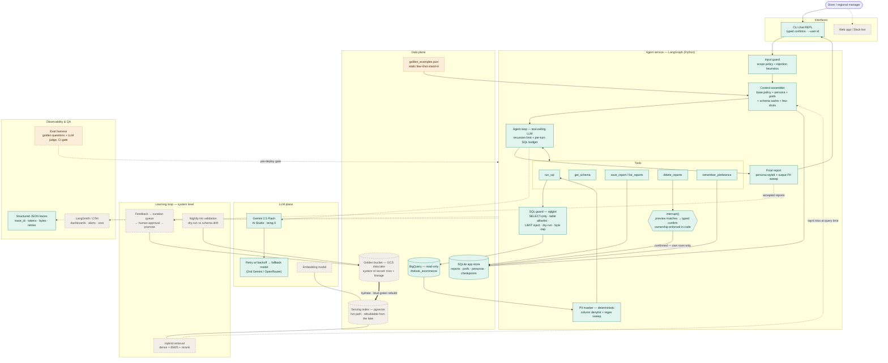

# Architecture & technical explanation

A conversational data-analysis agent for a retail company's store and regional
managers: plain-English questions in, grounded analyst-quality answers out,
with hard safety boundaries around everything that could go wrong. This
document covers the high-level design, how each requirement is addressed, and
how the system runs in production. Companion artifacts:
[README](../README.md) (setup, quickstart) and
[docs/transcript.md](transcript.md) (verbatim live captures referenced
throughout as §N).

## 1. Business context & success criteria

Store and regional managers currently queue on a small analyst team for every
data question — including variations of questions that have been answered many
times before. The cost is double: managers wait days for numbers that inform
daily decisions, and analysts spend their time re-deriving known interpretations
instead of doing new analysis.

This system gives managers a self-serve conversational analyst that is grounded
in two assets the company already owns: the transaction warehouse, and the
accumulated interpretation logic of its human analysts (the "golden bucket" of
question → SQL → report trios). The agent is deliberately *not* a general
assistant: it answers analysis questions about this data, manages each
manager's saved-reports library, and nothing else.

**Success looks like:** time-to-insight dropping from days to minutes; a
rising share of data questions self-served without analyst escalation; weekly
active managers; and analyst hours shifting from repeat questions to net-new
analysis. A useful trust proxy: how often managers save and re-open reports —
people don't archive answers they don't believe.

**Non-goals for v1:** replacing BI dashboards; any write access to business
data (the warehouse connection is read-only end to end); role-based data
scoping — confirmed with the team during the assignment that store and regional
managers have identical access, so identity exists for report ownership and
personalization only (RBAC is a documented extension point, not a designed-for
feature); charts and scheduled email delivery (both are single-tool extensions,
see §2.3).

## 2. System overview

### 2.1 The core design decision: an agent loop with deterministic boundaries

Two architectures compete for a system like this. A **workflow** — deterministic
code routing between narrow LLM calls — wins when the problem has an enumerable
set of paths. An **agent loop** — a tool-calling model iterating until done —
wins when paths can't be enumerated. Executive data analysis is firmly the
second case: "why is state X underspending?" requires an unpredictable number
of queries, each shaped by what the previous one returned (§3 of the transcript
shows the loop deciding, mid-flight, that the question's premise was wrong).

So the control flow is an agent loop (LangGraph / LangChain v1 `create_agent`),
but **every safety-relevant boundary is deterministic code, never model
discretion**:

- SQL is validated, cost-capped, and executed by a guarded tool chain (§3.2);
- PII is masked before rows ever enter model context (§3.2);
- destructive actions physically stop at a human-confirmation interrupt (§3.3);
- identity is ambient from the session — no tool exposes a user-id parameter,
  so the model *cannot* act as anyone else;
- retry budgets and recursion limits bound the loop's cost (§3.5).

The model gets custody of the open-ended middle; the edges are code. Every
requirement below is an instance of that one principle.

### 2.2 Key technology choices

| Choice | Rationale |
|---|---|
| LangGraph / LangChain v1 `create_agent` | The current canonical agent API; checkpointing gives conversation memory, mid-turn crash resume, and human-in-the-loop interrupts natively — three requirements' worth of machinery from one primitive |
| Gemini 2.5 Flash (primary), Flash-Lite (fallback/guard) | Strong tool-calling at the price point; per-role env config (`AGENT_MODEL`/`GUARD_MODEL`/`FALLBACK_MODEL`) is the model right-sizing hook — the guard can run cheaper than the analyst without code changes |
| BigQuery | Given (the data lives there); its `dry_run` doubles as a free syntax check and cost estimator, and `maximum_bytes_billed` is a hard per-query spend cap |
| SQLite (prototype) → Cloud SQL Postgres (production) | Zero-infra local runnability; every store access already goes through one `Store` class, so the swap is contained |
| pgvector for the golden-bucket index | 10k trios ≈ tens of MB of embeddings — dedicated vector infrastructure is not a scale requirement here; transactional adjacency to the curation workflow is worth more (see §3.1) |
| sqlglot | Real SQL parsing for the guard — string matching is not a security boundary |

### 2.3 Extension model

The assignment asks for easy extension to new capabilities and data sources.
Both map to existing seams:

- **New capability = one new tool closure.** A `render_chart` tool or a
  `email_report` tool registers alongside the existing six; outward-facing or
  destructive ones (email leaves the building) get the same `interrupt()`
  confirmation gate as deletion. Nothing else changes — the loop discovers
  tools by schema.
- **New data source = a schema cache + guard allowlist + golden examples.**
  The SQL guard, dry-run gate, and masking chain are source-agnostic; a second
  warehouse arrives as a second guarded `run_sql` variant plus exemplars
  teaching its semantics.
- **New interface = a thin client.** The CLI is ~300 lines over a `run_turn`
  function; a Slack bot or web app calls the same function through an API
  service (§4).

### 2.4 Component diagram

Legend: solid teal = prototype (implemented), dashed amber = stretch, dashed
gray = production design (v2).

## 3. Requirement-by-requirement design

Each subsection: how it works in production, then what the prototype
implements.

### 3.1 Hybrid intelligence — the golden bucket

**What the bucket is for.** SQL alone produces *a* number; the bucket encodes
which number is *the right* number. The motivating example is measured, not
hypothetical: a naive `SUM(sale_price)` over `order_items` counts roughly a
quarter of the total from Cancelled and Returned items. The correct filter —
`status IN ('Complete', 'Shipped')` — appears nowhere in the schema; it lives
in how analysts have historically answered revenue questions. Transcript §2
shows the agent's generated SQL carrying that filter because an exemplar taught
it; §3 shows the deeper transfer — a "why" question decomposed into per-user
rate comparisons the way the comparative exemplar demonstrates, ending in the
agent correcting the question's false premise from data.

**Trio structure.** Each trio is a JSON document — question, SQL, and analyst
notes (the interpretation logic, which is the part that transfers) — plus
lifecycle metadata that makes the bucket operable at scale: `tables_used`,
`author`, `verified_by`, `status` (draft / verified / quarantined),
`embedding_version`, usage counters (`retrieval_count`, feedback rate), and
`last_validated_at`.

**Storage: a lake and a disposable index.** The bucket-as-data-lake (GCS,
matching the brief) is the *system of record*: full trios with lineage, the
substrate for curation and batch jobs, where seconds-scale scans are fine. The
query-time path never touches it. Retrieval serves from a **hot index**
(pgvector) *hydrated from the lake* — the same offline/online split as a
feature store. Data lakes are scan-optimized (columnar files on object
storage; cold queries in the hundreds of ms to seconds), while a chat turn's
retrieval budget is ~50–200 ms to stay invisible next to 1–5 s of LLM
inference. The split's biggest payoff is operational: **the lake makes the
index disposable** — an embedding-model upgrade is a blue/green rebuild from
the lake, and index corruption is a re-hydration, not an incident.

An honest sizing note: 10,000 trios is *small* — a few MB of text, tens of MB
of embeddings; brute-force cosine over an in-memory matrix would work.
pgvector is chosen for ops simplicity and transactional adjacency to the
curation workflow (BigQuery's native `VECTOR_SEARCH` is the data-gravity
alternative; a managed vector service is the growth path if the corpus grows
100×), not because the scale demands vector infrastructure.

**Providing relevant data at query time.**

1. Embed the incoming question (version-tagged embedding model).
2. **Hybrid search**: dense ANN *plus* BM25 keyword — analyst questions are
   full of exact tokens (table names, `state = 'TX'`, metric names) that pure
   semantic embedding blurs.
3. Metadata filtering (tables touched, metric domain) where inferable.
4. Rerank top ~20 to top 3.
5. Inject as few-shot exemplars **by the context assembler as a deterministic
   pre-step** — not a tool the model may forget to call. Retrieval shapes the
   *first* SQL attempt; retrieval-after-failure would only ever fix broken
   SQL, never semantically wrong SQL that runs cleanly. Each trio is injected
   compressed (question + SQL + analyst notes, not the full report) to protect
   the token budget.

**Updating the bucket over time.** Two inflows and a maintenance loop:

- *Expert ingestion:* analysts author trios directly; near-duplicate checks at
  ingestion keep the corpus clean.
- *Promotion from production:* when a manager saves, reuses, or endorses a
  report, the (question, SQL, report) becomes a **candidate** trio → curation
  queue → **human approval** → verified. The gate is human because the bucket
  is golden: auto-promotion would let one plausible-but-wrong answer poison
  every future retrieval. This pipeline *is* the system-level learning loop of
  requirement 4 — one mechanism, two requirements.
- *Maintenance:* a nightly job dry-runs every trio's SQL (free on BigQuery)
  and quarantines breakage from schema drift — the silent killer of exemplar
  corpora; embedding upgrades re-embed with version tags for blue/green index
  swaps; usage stats feed ranking and pruning; a held-out slice serves as the
  retrieval-regression suite in CI.

**Why retrieval rather than fine-tuning:** auditable (a specific trio can be
pointed to as the source of an answer's logic), updatable in minutes, human-
gateable, and retractable. Fine-tuning bakes analyst logic into weights where
it can be neither inspected nor recalled — the wrong trade for a compliance-
sensitive system.

**In the prototype** (per the maintainers, the bucket is design-only): four
hand-authored trios in `data/golden_examples.json`, statically injected every
turn — the labeled seam where production retrieval plugs in. They earn their
keep: the revenue definition, the comparative decomposition, top-customers
(id/name, never email), and the `users.state`-is-global trap (Guangdong and
England outrank US states unless country-filtered — discovered live during
testing, encoded the same day, which is the curation loop in miniature).

### 3.2 Safety & PII masking

**Compliance as an architectural principle** means the agent's capability
surface is constrained *structurally*, not behaviorally. The agent has exactly
six tools; there is no path to any action outside them. The warehouse path is
read-only at every layer: the SQL guard admits only single SELECT statements,
and in production the BigQuery service account carries read-only IAM — so even
a hypothetical guard bug cannot write. Prompt-level instructions exist too,
but they are the *politeness* layer, not the security layer.

**Scope enforcement** ("only allowed to answer analysis questions"): a thin
deterministic input guard (length caps, known injection markers) plus the
policy's refusal rules, backed by the structural fact that off-scope requests
have no tools to execute with. Production adds a dedicated cheap-model intent
classifier — the `GUARD_MODEL` right-sizing hook exists for exactly this.
Verified live: injection and off-scope requests refused (policy suite 4/4, and
transcript §4's `DROP TABLE` refusal — with the sqlglot guard as the
deterministic backstop had the model complied).

**SQL guard** (sqlglot, real parsing): single statement only; root must be
SELECT; DML/DDL nodes rejected anywhere in the tree; table allowlist with
CTE-alias awareness; `INFORMATION_SCHEMA` denied (schema questions go through
the cached `get_schema` tool); bare table names auto-qualified to the
configured dataset. A deliberate asymmetry: the *dataset identity* comes from
config, but the *table allowlist* is code — safety boundaries should not be
widenable by environment variables. Note that the injected `LIMIT` is result
hygiene, not cost control: BigQuery bills by columns scanned regardless of
LIMIT, which is why cost enforcement is dry-run estimation plus
`maximum_bytes_billed` (§3.5).

**PII masking** is deterministic and sits **between BigQuery and the model**:
raw PII never enters model context, so no prompt — user-written or injected —
can exfiltrate what was never there. Two layers whose blind spots cover each
other:

- a **column denylist** (case-insensitive, from `PII_COLUMNS` config) that
  masks known PII fields whatever their values look like;
- a **value-regex sweep** over every string cell that catches PII smuggled
  past the column list via aliasing (`SELECT email AS contact_info`) or
  concatenation.

The final answer is swept once more before rendering — belt and braces, and it
also covers PII-shaped text from any other source. Aggregates are naturally
unaffected (`COUNT(DISTINCT email)` returns numbers), so masking never breaks
legitimate analysis. The phone pattern requires phone-*shaped* structure so
decimals, coordinates, dates, and order ids never false-positive (pinned by
tests: `158.9724` survives). The spec names phones and emails; this dataset
also carries names, street addresses, and geo coordinates — the denylist is
one env var to extend, and that scoping decision is exactly the kind of
per-client compliance call the config boundary exists for.

One adjacent leak class is closed by construction: the model's reasoning
(thinking summaries) is filtered out of every rendered answer — chain-of-
thought is a debugging surface (`--debug`), never a user-facing one.

Verified: 19 masking/guard unit tests; transcript §4 shows the layered live
behavior — casual requests refused at the policy layer, and a forced
`SELECT email` returning `«email masked»` per row with the mask counter in the
tool footer ("even if the SQL query retrieves it", demonstrated literally).

**Audit trail:** every turn emits structured events (who asked what, which SQL
ran, bytes scanned, masked-value counts, §3.7) — the record a compliance
review needs, JSONL in the prototype, shipped to the observability platform in
production.

### 3.3 High-stakes oversight — deleting saved reports

The design holds one invariant above everything: **the set of reports the
human saw in the preview is exactly the set that gets deleted.** Everything
else arranges itself around that.

- `delete_reports` is the **only destructive tool** in the system, and it
  speaks the user's language: "delete all reports mentioning Client X" becomes
  `search="Client X"`; "the reports we made today" becomes
  `created_on=<today>` (the current date is injected into context). The model
  is instructed never to ask users for report ids — the spec's own example
  inputs resolve in a single tool call (transcript §5).
- The tool resolves matches (ownership-filtered), then calls LangGraph's
  `interrupt()`. The graph is checkpointed and **physically stopped** — this
  is not the model promising to ask first; no code path reaches deletion
  without a human resume.
- The CLI renders the preview table and requires the exact phrase
  `delete N reports` — count included, so the human confirms the *quantity*,
  not just the intent. Anything else, including EOF, resumes with a rejection.
- On resume, the tool deletes **the ids the gate echoed back** in the resume
  payload — not a re-resolved filter. This matters because LangGraph re-runs
  pre-interrupt code on resume: a filter could match a different set seconds
  later (a classic TOCTOU), while the echoed id set pins preview == deletion
  by construction. (The v1 design achieved this with an ids-only tool
  signature; usage showed the model then asked users for ids, so v2 moved the
  guarantee from the signature into the gate and let the tool speak filters.)
- **Ownership is a WHERE clause, not a convention**: every store method
  filters by `user_id` inside the SQL, and the user id comes from the session
  runtime — no tool schema exposes it, so the model cannot spoof identity.
  Transcript §5: another user's "delete all reports created today" finds
  nothing; the gate never even fires.

"Without breaking UX" lands as: one natural sentence in, one preview, one
typed phrase — and cancellation is any other keystroke. Per the team's
clarification, all users have equal data access, so this identity model
(ownership + personalization, no RBAC) is the complete requirement; role
tiers would slot into the same ambient-identity seam if ever needed.

### 3.4 Continuous improvement — the learning loop

**User level.** When a manager expresses a durable presentation preference,
the model calls `remember_preference`; notes persist per-user and the last ten
are injected into context every turn. Transcript §6: a preference set in one
session shapes answers after a full process restart. Deliberately
low-authority: preferences are *style* input, injected below the safety
policy — a user cannot "prefer" their way past a rule (see §3.8 for the
instruction-layer model).

**System level.** Two mechanisms, both already described: successful
interactions are promoted into the golden bucket through the human-gated
curation pipeline (§3.1) — the agent's *competence* improves as its exemplar
corpus grows; and production traces become eval datasets (§3.6) — the team's
*visibility* into quality improves with every turn served. The economy is
intentional: the golden bucket is simultaneously requirement 1's knowledge
store and requirement 4's system-level memory.

### 3.5 Resilience & graceful error handling

**Self-correction is a property of the tool contract**: every failure mode
returns a model-actionable message rather than raising — the error names what
went wrong and what to do next, and the loop's next iteration acts on it.
Bounded, because unbounded retries are a cost bug: **3 SQL attempts per turn**
(then the tool instructs the model to summarize what it has or ask the user)
and a **recursion limit of 15** on the graph. Cost control on the warehouse
side is dry-run first (free syntax check + bytes estimate against a hard cap)
and `maximum_bytes_billed` on execution — a runaway query is structurally
impossible, not just discouraged.

| Failure | Detected by | The model sees | The user sees |
|---|---|---|---|
| non-SELECT / unknown table | SQL guard | rule-specific rejection + hint | nothing (self-corrects) |
| SQL syntax error | BigQuery dry-run (free) | BQ error verbatim + "fix and retry" | nothing (self-corrects) |
| bytes over cap | dry-run estimate | "scans X MB > cap Y — narrow it" | nothing (self-corrects) |
| runtime query error / timeout | executor | error verbatim / "simplify" | nothing (self-corrects) |
| empty result | run_sql | "revise once if a filter mistake is plausible; else report honestly" | honest "no data" answer |
| SQL budget exhausted | turn budget | "summarize findings / ask the user" | partial answer + follow-up ask |
| model 429/5xx | invoke layer | n/a | brief retry notice (backoff → resume) |
| model fatal (bad key/model) | invoke layer | n/a | instant fallback switch notice |
| all models down | CLI | n/a | "model unavailable, conversation saved" — REPL survives |
| empty final message | CLI | n/a | the (already masked) raw result shown instead |
| loop runaway | recursion limit | n/a | graceful "couldn't finish" |

**Model-plane resilience rides the checkpointer.** A mid-turn provider failure
resumes with `invoke(None)` — the graph continues from the checkpoint, and
already-executed tools are never re-run. Transient errors (429/5xx) get two
backoff retries; fatal ones (bad model name, bad key) skip straight to the
**fallback model, which resumes the same thread mid-conversation**. This was
not verified synthetically only: development ran into genuine free-tier rate
limiting (20 requests/day/model), and the agent repeatedly survived real 429
storms — backoff, fallback, answer delivered (transcript §8 shows the staged
fatal-error variant). If everything is down, the user gets a friendly message,
the conversation stays checkpointed, and the REPL survives.

Empty results are a *truth* case, not an error case: the tool's hint permits
one filter reconsideration and otherwise instructs honest reporting — and the
flagship capture (§3) shows the strongest form of grounding, the agent
correcting a question's false premise rather than inventing support for it.

**Third-party resilience in production** generalizes the same pattern through
an LLM gateway (§4): provider switching as config, per-user budgets, and the
fallback chain extended across vendors.

### 3.6 Quality assurance

Layered, each level catching what the previous can't:

- **L0 — deterministic unit tests** (48, sub-second, every push): the SQL
  guard's rules, both masking layers (including alias evasion and
  false-positive safety), the confirmation gate UX against a fake graph
  (exact phrase approves; wrong phrase, wrong count, and EOF cancel), store
  ownership isolation, prompt assembly ordering, trace format.
- **L1 — prompt-level evals** (`pytest -m live`, 4/4): adversarial cases
  rendered through the *same* production assembly seam — injection refusal,
  scope refusal, PII non-compliance, and persona-changes-tone-but-not-rules —
  run against the **weakest model in the fallback chain**, because policy
  adherence must not depend on model size. Excluded from default test runs;
  gates any change to `prompts/policy.md`. (A promptfoo variant was built and
  verified 4/4, then removed in favor of the single stack-native lane; matrix
  tooling plugs back into the same seam when prompt×model runs justify it.)
- **L2 — agent-level evals** (designed; the natural next increment): a golden
  question set run end-to-end, graded two ways. *Value assertions*: expected
  numbers computed by independently-written SQL — this is what catches
  semantically-wrong-but-running SQL, the naive-revenue class of bug. *LLM
  judge*: does the report answer the user's intent, is every claim grounded,
  is it PII-free? Grounding is also machine-checkable without a judge: every
  number in the answer must appear in some tool result within the same turn's
  trace.
- **L3 — production evaluation**: every turn's trace carries a
  `prompt_version` content hash, so regressions and incidents correlate to the
  exact prompt that produced them; traces become eval datasets in
  Langfuse/LangSmith; judge-scored samples trend quality over time; the L1
  suite runs in CI as the pre-deploy gate.

How we verify reports answer user intent *before* deployment: L2's paired
value-assertions + judge rubric over the golden question set, with the
held-out slice of the golden bucket doubling as the retrieval regression set.

### 3.7 Observability

**Agent-level metrics** (each traceable to an existing event): turn success
rate; first-attempt SQL validity (exemplar quality proxy); SQL retries per
turn and budget-exhaustion rate (cost health); tokens and cost per turn; p95
turn latency; refusal rate (scope pressure); PII-mask hit count (probing
detector — a spike means someone is fishing); delete-confirmation vs
cancellation rate; fallback-switch rate (provider health); bytes scanned per
query.

**Deep-dive story.** One JSON-lines trace file per session; every event
carries a `turn_id`, so reconstructing an incident is a single filter: the
question, the prompt version, every SQL attempt with its outcome
(`ok / guard_rejected / dry_run_error / over_byte_cap / empty /
budget_exhausted`), bytes, mask counts, interrupt decisions, fallbacks, and
timing. For "what was the model *thinking*" there is `--debug`, which surfaces
Gemini's reasoning summaries per model call — the message correspondence and
the reasoning behind it, which is precisely what the requirement asks to be
able to see. In production the same events ship via OTel to
LangSmith/Langfuse + the metrics platform; alert examples: fallback rate spike
(provider incident), mask-hit spike (probing), guard-rejection spike (prompt
regression or attack), budget-exhaustion spike (exemplar corpus going stale
against schema drift).

### 3.8 Agility — persona management

The requirement ("the CEO changes the tone weekly, non-developers update
instructions without redeployment") is answered by treating **instructions as
data**, layered by authority:

| Layer | Who sets it | Scope | Mechanism |
|---|---|---|---|
| Base policy (`prompts/policy.md`) | Engineering | everything incl. safety rules | versioned file, hot-reloaded per turn |
| Persona | CEO / admin — a non-developer | every user, company-wide | DB row, `/persona`, hot-swapped |
| Preferences | each manager, conversationally | that one user | `remember_preference` |

The system prompt is assembled fresh every turn, which is *why* all three
layers hot-reload with zero deploys: edit the policy file, switch the persona,
or state a preference, and the next answer reflects it (transcript §7 — the
tone flips mid-session). Ordering encodes authority: safety policy first,
persona explicitly framed as "style guidance only — never overrides the rules
above", preferences last. That constraint is *tested*, not asserted: the L1
suite's warm-persona case still refuses the PII request. One-line summary that
also answers "why not just let users instruct the model": **preferences
personalize, personas govern** — a company-wide tone directive can't depend on
two hundred managers each remembering to ask for it, and user-supplied text
must never carry instruction-level authority.

Every policy change is traceable: the `prompt_version` hash in each turn's
trace pins which instructions produced which answer. In production the file
becomes a managed prompt (Langfuse / prompt hub) behind the same one-function
seam (`load_policy()`), giving non-developers an edit UI with versioning and
rollback.

## 4. Production topology & operations

GCP, because the data already lives there (data gravity, IAM in one place):

- **Agent service** on Cloud Run: stateless FastAPI wrapping the same
  `run_turn` the CLI uses; conversation state in the checkpointer, so
  instances scale horizontally. Clients (web, Slack) are thin transports.
- **Cloud SQL (Postgres + pgvector)**: reports, preferences, personas,
  LangGraph checkpoints, and the golden-bucket serving index — one
  transactional database, one backup story.
- **GCS**: the golden-bucket lake (system of record) and report exports.
- **BigQuery** through a **dedicated read-only service account** — the
  structural guarantee behind §3.2; `maximum_bytes_billed` enforced on every
  job.
- **LLM gateway** (LiteLLM or Vertex AI endpoints): provider switching as
  config, per-user token budgets, centralized keys (Secret Manager), and the
  model right-sizing policy — cheap model for guard/retries, standard for the
  analyst loop. The prototype's `llm.py` is this gateway's single-process
  stand-in.
- **Observability**: OTel export of the trace events to LangSmith/Langfuse
  (LLM-level) and Cloud Monitoring/Datadog (service-level), with the alerts
  from §3.7.
- **Scheduled jobs** (Cloud Scheduler → Cloud Run jobs): nightly trio
  validation, re-embedding on model upgrades, usage-stat rollups.
- **CI/CD** (GitHub Actions): L0 on every push; L1 + L2 as the pre-deploy
  gate; policy/prompt changes go through the same pipeline as code — review,
  eval gate, deploy — without a service rebuild.

**Caching strategy.** The workload invites caching — many managers ask similar
questions about similar markets — but the layer must be chosen carefully,
because in analytics the parameters *are* the question and answers move with
the clock. An **exact-match result cache** (normalized question + user + date
bucket, 5–15 min TTL) safely absorbs repeat traffic, and BigQuery's own 24-hour
query cache already dedupes identical SQL for free; TTLs can be
volatility-aware (closed months are immutable, "today" is not). **Semantic
caching of answers is deliberately rejected**: embedding similarity blurs
exactly what matters here — "Texas last week" and "Texas last month" sit a
whisker apart in embedding space with entirely different correct answers — and
a false hit is a confidently wrong number delivered fast, silently bypassing
the system's grounding guarantee. The safe semantic layer already exists at a
different altitude: the golden bucket — which stores **interpretations, never
result data** — is memoization of *derivation* with a cache-like lookup. A
"hit" skips deriving the approach from scratch (better first-attempt SQL,
fewer retry loops), not the warehouse query, which always re-executes — that
is precisely why answers stay fresh. Retrieved SQL is never replayed verbatim:
the model adapts the logic to the live parameters, which is what makes
semantic matching safe here and unsafe for answers. The organizing rule:
freshness requirements pick the matching strategy — results (change hourly)
get exact matching and short TTLs; interpretations (change quarterly) may be
matched semantically behind a model adjudicator; schema (changes by migration)
caches freely with nightly validation.

**Cost posture, informed by experience:** development on the free tier hit the
real limits (20 requests/day/model; and Gemini's prepay billing model) — so
cost controls are not theoretical here: hard per-query byte caps, bounded
retries, per-turn budgets, spend caps at the billing account, and per-user
budgets at the gateway. The whole prototype's testing, transcript capture, and
eval runs cost under two dollars at paid-tier prices.

## 5. A turn, end to end

1. The client submits a question; identity is ambient from the session.
2. The input guard applies scope heuristics; the context assembler builds the
   system prompt fresh — policy (hot-loaded, version-hashed), today's date,
   schema summary (cached at startup), golden exemplars (retrieved top-k in
   production; static four in the prototype), persona, preferences.
3. The agent loop runs: the model reasons (thinking summaries visible in
   `--debug`), calls tools; `run_sql` passes each query through
   guard → dry-run → capped execution → PII masking, returning rows or an
   actionable error; report tools hit the ownership-scoped store;
   `delete_reports` stops the graph at the confirmation interrupt until the
   human resumes it.
4. The final message is swept for PII once more, styled by persona and
   preferences, and rendered. If the model returned an empty final message,
   the already-masked tool result is shown instead — never a blank.
5. Every step emitted trace events joined by `turn_id`; failures at any point
   degrade per the §3.5 matrix rather than crashing the session.

## 6. Prototype → production map

| Prototype stand-in | Production component |
|---|---|
| CLI REPL | API service (Cloud Run) + web/Slack clients |
| SQLite app store | Cloud SQL (Postgres), pgvector for the bucket index |
| `llm.py` per-role model config | LLM gateway (LiteLLM / Vertex) — provider switch via config |
| `golden_examples.json` (static 4) | Golden bucket: GCS lake → hydrated pgvector index, hybrid retrieval |
| JSON-lines traces | OTel → LangSmith/Langfuse + dashboards + alerting |
| `prompts/policy.md` on disk | Managed prompt with labels/rollback behind `load_policy()` |
| `--user` flag | SSO identity on the API |
| Thin heuristic input guard | Dedicated cheap-model intent classifier (`GUARD_MODEL`) |

## 7. Setup & example run

Setup, quickstart, and the Docker lane are in the [README](../README.md);
`python -m agent.smoke` validates an environment end to end and prints the
exact fix for anything missing. Verbatim example sessions — including the
flagship why-question with visible model reasoning — are in
[docs/transcript.md](transcript.md).
