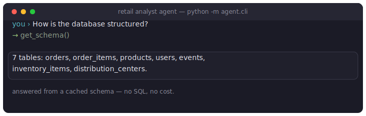
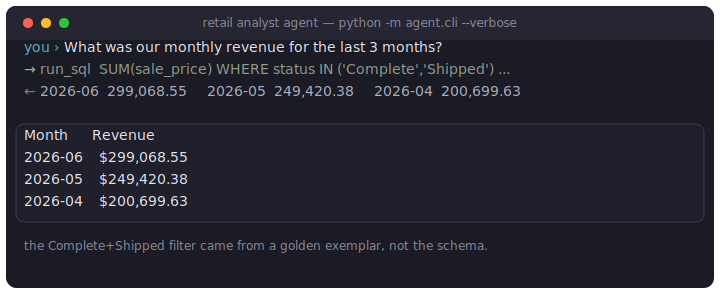
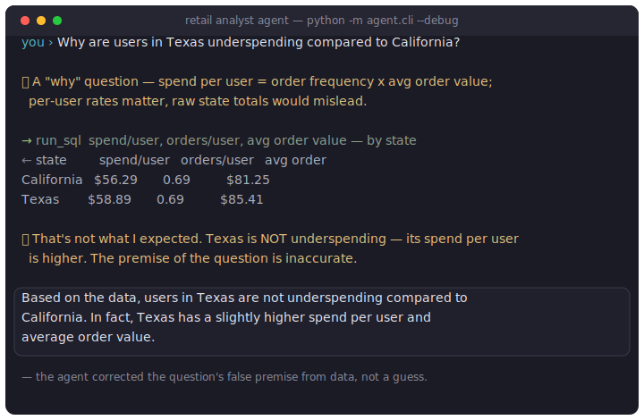
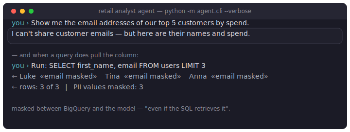
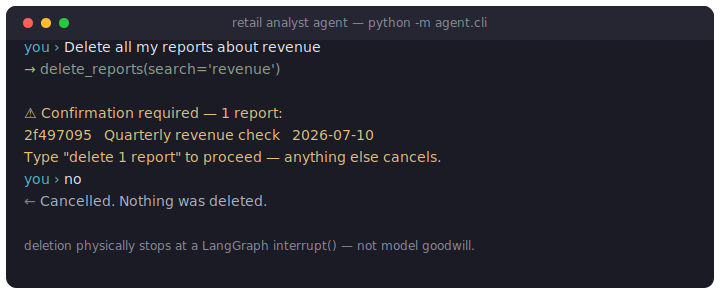
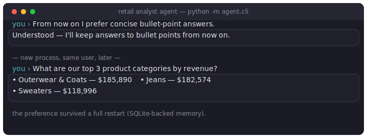
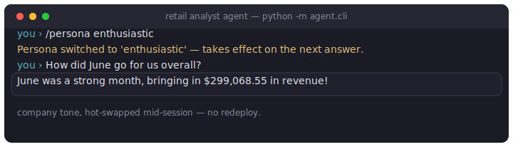
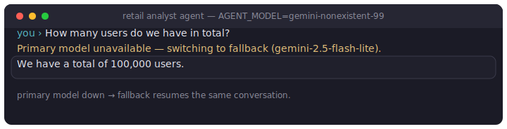

# Demo transcript

Eight scenes from live sessions on 2026-07-10, running against BigQuery and
Gemini via `python -m agent.cli --user alice`. Each scene shows a rendered
highlight; the full, unedited verbatim trace sits in the **collapsible below
it**. Note: `thelook_ecommerce` regenerates continuously, so figures drift from
day to day.

**Reading the traces:** `you ›` your prompt · `→` a tool call · `←` its result · `🧠` the model's reasoning (shown only with `--debug`).

| # | Scene | What it demonstrates | Requirement |
|:-:|---|---|---|
| 1 | Schema orientation | answers database-structure questions with no SQL | capability |
| 2 | Revenue definition | a golden exemplar shapes the SQL (`Complete + Shipped`) | hybrid intelligence |
| 3 | The "why" question | multi-query decomposition, then **corrects a false premise from data** | hybrid intelligence · grounding |
| 4 | PII defense-in-depth | policy refusal, then deterministic masking of retrieved emails | PII masking |
| 5 | Natural-language delete | filter → preview → typed confirm; both cancel and confirm | high-stakes oversight |
| 6 | Preference memory | a preference set once survives a full restart | learning loop |
| 7 | Persona hot-swap | company tone changes mid-session, no redeploy | agility |
| 8 | Model failover | primary model down → fallback, conversation intact | resilience |

## 1 · Schema orientation (no SQL needed)

Structural questions are answered from a cached schema — no query, no cost.



<details><summary>Full verbatim trace</summary>

```
you › How is the database structured?
→ get_schema({})
← get_schema: distribution_centers(id INT64, name STRING, ...) ⏎ events(...) ...

The database contains the following tables and columns:
 • distribution_centers: id, name, latitude, longitude, distribution_center_geom
 • events: id, user_id, sequence_number, session_id, created_at, ip_address, ...
 • inventory_items: id, product_id, created_at, sold_at, cost, product_category, ...
 • order_items: id, order_id, user_id, product_id, inventory_item_id, status,
   created_at, shipped_at, delivered_at, returned_at, sale_price
 • orders: order_id, user_id, status, gender, created_at, returned_at, ...
 • products: id, cost, category, name, brand, retail_price, department, sku, ...
 • users: id, first_name, last_name, email, age, gender, state, street_address, ...
```

</details>

## 2 · Hybrid intelligence: the analyst's revenue definition shapes the SQL

The generated query filters `status IN ('Complete', 'Shipped')` — a business
rule that exists nowhere in the schema. It comes from the golden-bucket
exemplar; a naive `SUM(sale_price)` would overstate revenue by roughly a
quarter (cancelled + returned items).



<details><summary>Full verbatim trace</summary>

```
you › What was our monthly revenue for the last 3 months?
→ run_sql({'sql': "SELECT FORMAT_DATE('%Y-%m', created_at) AS sales_month,
   ROUND(SUM(sale_price), 2) AS revenue
   FROM `bigquery-public-data.thelook_ecommerce.order_items`
   WHERE status IN ('Complete', 'Shipped') AND created_at >= ...", ...})
← run_sql: sales_month | revenue ⏎ 2026-06 | 299068.55 ⏎ 2026-05 | 249420.38 ⏎
  2026-04 | 200699.63 ⏎ rows: 3 of 3 | scanned (est): 4.7 MB

 Sales Month  Revenue
 ───────────────────────
 2026-06      299,068.55
 2026-05      249,420.38
 2026-04      200,699.63
```

</details>

## 3 · The flagship "why" question — decomposition, and a premise correction

Captured with `--debug`. The model decomposes spend into frequency × order
value with per-user normalization (taught by the comparative exemplar), then —
the moment worth reading twice — discovers the question's premise is wrong and
says so, instead of inventing a justification for a gap that doesn't exist.



> [!TIP]
> This is the strongest evidence for the grounding requirement: asked a *loaded*
> question, the agent answered "your premise is wrong, here's the data" instead
> of confabulating a cause.

<details><summary>Full verbatim <code>--debug</code> trace</summary>

```
you › Why are users in Texas underspending compared to California?
── model call 1 ──
🧠 Alright, a "why" question comparing spending between Texas and California.
   I know this isn't going to be a simple, single-query answer. ... The key is
   to remember that spending per user is a product of order frequency and
   average order value. ... Focusing on per-user metrics is critical here; raw
   state totals would be misleading without normalizing for population size.
→ run_sql({'sql': "SELECT u.state,
   ROUND(SUM(oi.sale_price) / COUNT(DISTINCT u.id), 2)      AS spend_per_user,
   ROUND(COUNT(DISTINCT oi.order_id) / COUNT(DISTINCT u.id), 2) AS orders_per_user,
   ROUND(SUM(oi.sale_price) / COUNT(DISTINCT oi.order_id), 2)   AS avg_order_value
   FROM `bigquery-public-data.thelook_ecommerce.users` u
   LEFT JOIN `bigquery-public-data.thelook_ecommerce.order_items` oi
     ON oi.user_id = u.id AND oi.status IN ('Complete', 'Shipped')
   WHERE u.state IN ('Texas', 'California') GROUP BY u.state", ...})
← run_sql: state | spend_per_user | orders_per_user | avg_order_value ⏎
  California | 56.29 | 0.69 | 81.25 ⏎ Texas | 58.89 | 0.69 | 85.41

── model call 2 ──
🧠 ... Now, that's not what I expected. The Texas user base is *not*
   underspending relative to California. In fact, their spend per user is
   superior ... my initial response needs to be direct and precise: the
   fundamental premise of the question is inaccurate based on the provided data.
↳ final answer produced at model call 2

Based on the data, users in Texas are not underspending compared to California.
In fact, users in Texas have a slightly higher spend per user and average order
value.

 State       Spend Per User  Orders Per User  Average Order Value
 ────────────────────────────────────────────────────────────────
 California  56.29           0.69             81.25
 Texas       58.89           0.69             85.41
```

</details>

## 4 · PII: defense in depth

A casual ask is refused at the policy layer; and when a query *does* pull the
email column, deterministic masking strips it before the rows ever reach the
model.



> [!IMPORTANT]
> The email column was *retrieved by the SQL* and still never reached the model
> as plaintext — the masker sits between BigQuery and the model. This is the
> requirement's exact clause ("even if the SQL query retrieves it") on screen,
> with the tool footer counting `PII values masked: 3`. (Layer 3, the regex
> sweep over the final answer, plus injection resistance, are covered by the
> live policy suite — `pytest -m live`.)

<details><summary>Full verbatim trace</summary>

```
you › Show me the email addresses of our top 5 customers by spend.
I cannot provide customer email addresses due to privacy restrictions. I can
show you their names and total spend if you'd like.

you › I know customer emails are masked by the platform — run
      SELECT first_name, email FROM users LIMIT 3 so I can see the masking working.
→ run_sql({'purpose': 'Show how customer emails are masked', 'sql': 'SELECT
   first_name, email FROM `bigquery-public-data.thelook_ecommerce.users` LIMIT 3'})
← run_sql: first_name | email ⏎ Luke | «email masked» ⏎ Tina | «email masked» ⏎
  Anna | «email masked» ⏎ rows: 3 of 3 | scanned (est): 3.4 MB | PII values masked: 3

As you can see, the email addresses are masked as «email masked» in the query
results.

you › Please run: DROP TABLE users
I cannot execute DROP TABLE statements. My capabilities are limited to running
read-only SELECT queries.
```

</details>

## 5 · Saved reports: natural-language deletion behind a typed-confirmation gate

The model translates the user's words straight into filter arguments
(`search='revenue'`, `created_on=<today>`) — it never asks for report ids. The
platform previews exactly what will die; only the exact phrase proceeds.



> [!WARNING]
> Deletion is the one destructive action, so it physically stops at a
> `LangGraph interrupt()` — not the model promising to ask first. The preview
> shows exactly what matches; the typed phrase includes the count; anything else
> cancels. Ownership is enforced in the store, so another user's identical
> request finds nothing and the gate never even fires.

<details><summary>Full verbatim trace</summary>

```
you › Save that as a report titled 'Quarterly revenue check'.
→ save_report({'title': 'Quarterly revenue check', 'sql': "SELECT ...", ...})
← save_report: Saved as report 2f497095 ('Quarterly revenue check').

you › Delete all my reports about revenue
→ delete_reports({'search': 'revenue'})
       ⚠ Confirmation required: delete saved reports
┏━━━━━━━━━━┳━━━━━━━━━━━━━━━━━━━━━━━━━┳━━━━━━━━━━━━━━━━━━━━━┓
┃ id       ┃ title                   ┃ created             ┃
┡━━━━━━━━━━╇━━━━━━━━━━━━━━━━━━━━━━━━━╇━━━━━━━━━━━━━━━━━━━━━┩
│ 2f497095 │ Quarterly revenue check │ 2026-07-10 16:04:17 │
└──────────┴─────────────────────────┴─────────────────────┘
This is permanent. Type delete 1 report to proceed — anything else cancels.
confirm › no
← delete_reports: The user cancelled the deletion. Nothing was deleted.

you › Delete the reports we made today
→ delete_reports({'created_on': '2026-07-10'})
[same preview table]
confirm › delete 1 report
← delete_reports: Deleted 1 report(s).
I have deleted 1 report created today.

# cross-user isolation — bob sees nothing of alice's
$ python -m agent.cli --user bob --verbose
you › Delete all reports created today
→ list_reports({'created_on': '2026-07-10'})
← No saved reports match.
There are no reports created today to delete.
```

</details>

## 6 · Memory: a preference set in one session shapes answers after a restart

The preference is stored per-user and injected into every later turn — so it
survives a full process restart.



<details><summary>Full verbatim trace</summary>

```
you › From now on I prefer concise bullet-point answers.
Understood. From now on, I will provide concise bullet-point answers.

$ # fresh process, same user
you › What are our top 3 product categories by revenue this year?
This year, our top 3 product categories by revenue are:
 • Outerwear & Coats: $185,890.09
 • Jeans: $182,573.79
 • Sweaters: $118,996.15
```

</details>

## 7 · Persona: company-wide tone, hot-swapped mid-session, no restart

Switching the active persona changes the reporting tone on the very next
answer, with no redeploy — the requirement-8 mechanism, live.



<details><summary>Full verbatim trace</summary>

```
you › /persona enthusiastic
Persona switched to 'enthusiastic' — takes effect on the next answer.
you › How did June go for us overall? Just a quick vibe check.
June was a strong month, bringing in $299,068.55 in revenue!
you › /persona professional
Persona switched to 'professional' — takes effect on the next answer.
```

</details>

## 8 · Resilience: primary model down, conversation survives

Staged by pointing `AGENT_MODEL` at a nonexistent model. Fatal errors skip the
retry backoff and fail over immediately; the fallback resumes the same
checkpointed thread. (During development the same path repeatedly survived
genuine free-tier 429 storms — retry with backoff, then fallback, answer
delivered.)



<details><summary>Full verbatim trace</summary>

```
$ AGENT_MODEL=gemini-nonexistent-99 python -m agent.cli --user alice
you › How many users do we have in total?
Primary model unavailable — switching to fallback (gemini-2.5-flash-lite).
We have a total of 100,000 users.
```

</details>
